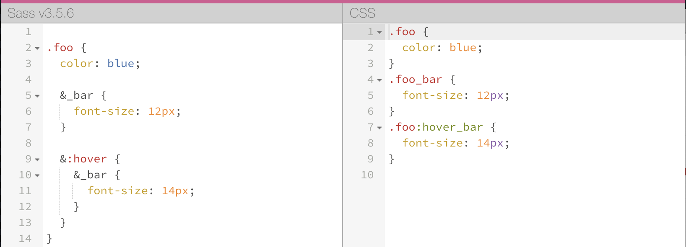
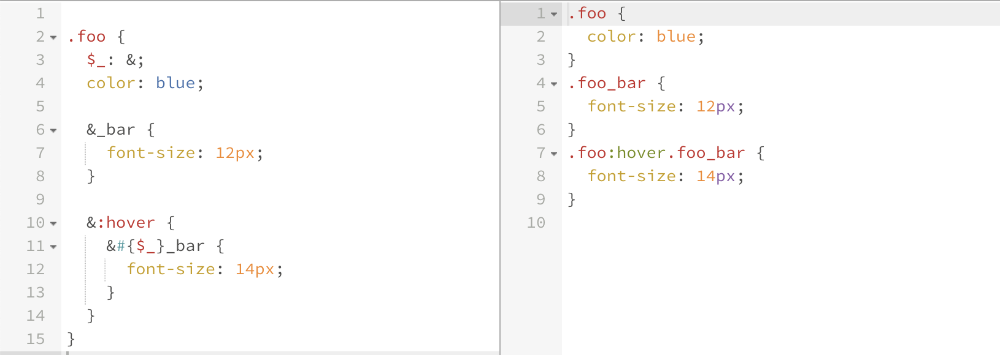

# no-variable-declaration

This rule forbid the declaration of variables (CSS, LESS and SASS).

## options

### true

The following patterns are considered violations:

```css
--root {
  --var: white;
}
```

```less
@var: white;
```

```scss
$var: white;
```

### ignoreLayers: ["string"]

Variables can be used to simply the use/update of common values like colors, padding, margin...

This option disable the rule in the layers targeted by the option's content.

For example, given `ignoreLayers: ["settings"]`;
_(`settings` is the recommended layer for variables declarations in ITCSS)_

The following patterns are *not* considered violations:

```scss
// file `styles/settings/_settings.colors.scss`
$color: white;
```

```scss
// file `styles/settings/settings.scss`
$color: white;
```

The following patterns are considered violations:

```scss
// file `styles/layer/main.scss`
$color: white;
```

```scss
// file `styles/layer/_layer.main.scss`
$color: white;
```

### ignoreVariables: ["string"]

Variables can be used for other things than simply defining themes colors/dimensions.
Let's take a simple example.



In this example we try to apply a style to the nested rule `.foo_bar` when `.foo` is hovered. But this is not what our generated CSS does.

A way to solve this problem is to concatenate `__bar` with a variable in the `&:hover rule`. Something like this :



This option (`ignoreVariables`) allow you to define a list of variables that will be ignored.

For example, given `ignoreVariables: ["$rule"]`

The following patterns are *not* considered violations:

```scss
$rule: &;
$rule: white;
```

The following patterns are considered violations:

```scss
$color: white;
```
